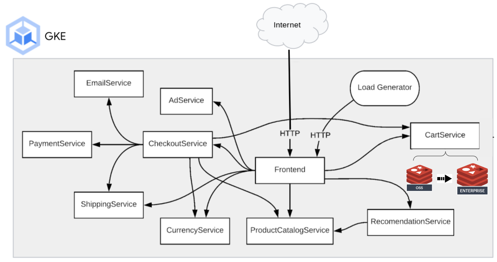

[](https://redis.com)
[](https://cloud.google.com)
[](https://github.com/Redislabs-Solution-Architects/gcp-microservices-demo/pulls)


# Scaling Microservices Applications: Migration to Redis Enterprise on Google Cloud
  
This demo repo shows you how to deploy a fully functioning microservices application on Google Cloud using Open Source Redis and migrate the data to Redis Enterprise with minimal downtime. 



## Prerequisites 
### Software to Install
`Only Linux has been tested`
* [gcloud command line](https://cloud.google.com/sdk/docs/install)
* [terraform](https://www.terraform.io/downloads)
* [kubectl](https://kubernetes.io/docs/tasks/tools/)
* [git](https://git-scm.com/book/en/v2/Getting-Started-Installing-Git)

### Accounts Needed
* [Google Cloud Account](https://console.cloud.google.com/)
### Information to Gather
#### Google Cloud
* Project ID
* Region
  
    
## Deployment
### Clone the Repo
```bash
git clone https://github.com/Redislabs-Solution-Architects/gcp-microservices-demo-qwiklabs.git
pushd gcp-microservices-demo-qwiklabs
```
### Create your own terraform.tfvars
The following values will need to be modified by you.
```bash
cat <<EOF >terraform.tfvars
gcp_project_id = "my_project"
EOF
```  
### Initialize Terraform
```bash
terraform init
```
### Deploy the stack
```bash
terraform apply --auto-approve
```
### What success looks like  
```bash
Apply complete! Resources: 9 added, 0 changed, 0 destroyed.

Outputs:

db_password = <sensitive>
gke_cluster_name = "gke-boutique"
db_private_endpoint = "redis-enterprise-database-headless:13188"
region = "us-central1"
```

### Store Redis Enterprise database information in environment variables for later use
```bash
export REDIS_DEST=`terraform output db_private_endpoint | tr -d '"'`
export REDIS_DEST_PASS=`terraform output db_password | tr -d '"'`
export REDIS_ENDPOINT="${REDIS_DEST},user=default,password=${REDIS_DEST_PASS}"
```
       
### Target your environment to the GKE cluster
```bash
gcloud container clusters get-credentials \
$(terraform output -raw gke_cluster_name) \
--region $(terraform output -raw region)
```

## Run the demo
Access the Online Boutique website by pointing your browser with the IP address from the following command as **http://<IP address>**:
```bash
kubectl -n redis get service frontend-external \
-o jsonpath='{.status.loadBalancer.ingress[0].ip}'
```
The web application is using the inbuilt OSS Redis container as the backing store for the shopping cart by default. Make sure you add some items to your shopping cart in order to see that data migration from OSS Redis to Redis Enterprise works later in the lab.
    
### Migrate the shopping cart data from OSS Redis to Redis Enterpirse
Set to **redis** namespace:    
```bash
kubectl config set-context --current --namespace=redis
```    
Create a K8s secret for Redis Enterprise database connection
```bash
kubectl apply -f - <<EOF
apiVersion: v1
kind: Secret
metadata:
  name: redis-creds
type: Opaque
stringData:
  REDIS_SOURCE: redis://redis-cart:6379
  REDIS_DEST: redis://${REDIS_DEST}
  REDIS_DEST_PASS: ${REDIS_DEST_PASS}
EOF
```   
Run a K8s job to migrate data from OSS Redis to Redis Enterprise database (Should take about 15 seconds)
```bash
kubectl apply -f https://raw.githubusercontent.com/Redislabs-Solution-Architects/gcp-microservices-demo/main/util/redis-migrator-job.yaml
```
        
### Patch the "Cart" deployment to point to the new Redis Enterprise Database
Run a K8s patch command to update the `cartservice` deployment to point to the new Redis Enterprise Endpoint (Should take about 30 seconds)
```bash
kubectl patch deployment cartservice --patch '{"spec":{"template":{"spec":{"containers":[{"name":"server","env":[{"name":"REDIS_ADDR","value":"'$REDIS_ENDPOINT'"}]}]}}}}'
```
    
### Verify if the same items in the shopping cart are backed by the Redis Enterprise database
Refresh your browswer and access the shopping cart content. The same items should appear in the shopping cart. Then add a few items to the shopping cart in order to verify the online boutique web application is pointing to the Redis Enterprise database. 


### Roll back to the OSS Redis to back the shopping cart content
Run the following patch command to configure the shopping cart to use OSS Redis again (Should take about 30 seconds)
```bash
kubectl patch deployment cartservice --patch '{"spec":{"template":{"spec":{"containers":[{"name":"server","env":[{"name":"REDIS_ADDR","value":"redis-cart:6379"}]}]}}}}'
```
Refresh your browswer and access the shopping cart content. You should not see the new items which are added earlier when Redis Enterprise is backing the shopping cart content.


### Patch the "Cart" deployment to point to the Redis Enterprise Database again for production
Run a K8s patch command to update the `cartservice` deployment to point to the Redis Enterprise Endpoint (Should take about 30 seconds)
```bash
kubectl patch deployment cartservice --patch '{"spec":{"template":{"spec":{"containers":[{"name":"server","env":[{"name":"REDIS_ADDR","value":"'$REDIS_ENDPOINT'"}]}]}}}}'
```
Refresh your browswer and access the shopping cart content. You should see the items which are added earlier.
   
    
### Delete local redis-cart based on OSS Redis
Now that everything is working and your items are still in your cart, you delete the OSS Redis deployment
```bash
kubectl delete deploy redis-cart
```

## Done!
Congrats! You've completed the demo.


# Terraform Module Documentation
<!-- BEGIN_TF_DOCS -->
## Inputs

| Name | Description | Type | Default | Required |
|------|-------------|------|---------|:--------:|
| <a name="input_gcp_project_id"></a> [gcp\_project\_id](#input\_gcp\_project\_id) | The project ID to deploy the cluter into | `string` | n/a | yes |
| <a name="input_cluster_name"></a> [cluster\_name](#input\_cluster\_name) | The name of the GKE cluster | `string` | `"boutique"` | no |
| <a name="input_gcp_region"></a> [gcp\_region](#input\_gcp\_region) | The region to deploy the cluster in | `string` | `"us-central1"` | no |
| <a name="input_gke_node_count"></a> [gke\_node\_count](#input\_gke\_node\_count) | The number of nodes to deploy in the cluster | `number` | `1` | no |
| <a name="input_gke_release_channel"></a> [gke\_release\_channel](#input\_gke\_release\_channel) | The gke release channel to deploy | `string` | `"RAPID"` | no |
| <a name="input_gke_machine_type"></a> [gke\_machine\_type](#input\_gke\_machine\_type) | The type of machine to deploy | `string` | `"c2-standard-4"` | no |
| <a name="input_redis_db_type"></a> [redis\_db\_type](#input\_redis\_db\_type) | The type of Redis DB to be setup by default. Valid options are 'OSS' or 'Ent' | `string` | `"OSS"` | no |

## Outputs

| Name | Description |
|------|-------------|
| <a name="output_gke_cluster_name"></a> [gke\_cluster\_name](#output\_gke\_cluster\_name) | The name of the GKE cluster |
| <a name="output_region"></a> [region](#output\_region) | The Region the GKE cluster is deployed |
| <a name="output_db_private_endpoint"></a> [db\_private\_endpoint](#output\_db\_private\_endpoint) | The Redis Enterprise DB endpoint |
| <a name="output_db_password"></a> [db\_password](#output\_db\_password) | The Redis Enterprise DB Password |
<!-- END_TF_DOCS -->
